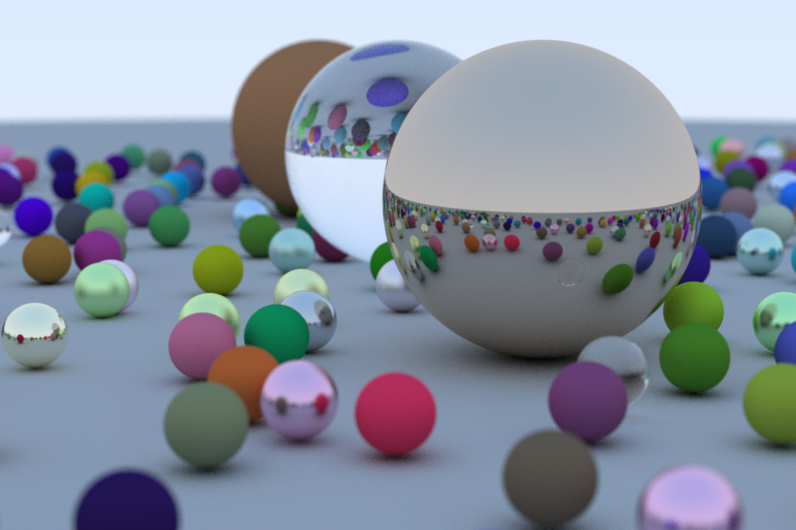
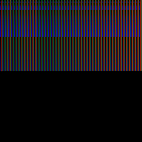

# Ray Tracer in One Weekend

See [the source of the authors](https://github.com/RayTracing/raytracing.github.io)

# Journey between debug and success

## Day 1

* 18:56 001 to 010 Fighting with stbi_write_bmp
* 21:31 Implementation of the class vec3
* 18:40 break
* 20:27 start again
* 20:50 make the operators `*` and `/` commutatif
* 21:00 start chapter 4
* 21:16 start chapter 5
* 21:41 I notice there is something wrong with the orientation of my axis. I originally thought  stb/std_image_write.c was writing the image upside down. I now have the intuition that one of the axis might be in the wrong direction. I decide to move on and to keep going ... I might debug it later
* 22:13 take a break
* 22:26 get back to it
* 22:45 bug : typo 'shpere' instead of 'sphere'
* 23:01 it indeed seem that my orientation is inverted :( ... tho, finished chapter 5
* 23:08 solved the problem: on minus missing in `lower_left_corner` and write the image top to bottom
* 23:10 Done for the first day

## Day 2

* 16:30 back to it
* 18:04 I wrote the metal material, but the document was not explaining how to modify the sphere class. I tries to do it myself and run into a seg fault. I checked the github repo and noticed I forgot to update the `hit_record` material properties.
* 18:06 I noticed the github repo also has the material in a seperated class (without checking on it), which I wanted to do earlier. I decide to it as well.
* 18:22 I ran into include loop problem: “invalid use of incomplete type” and “forward declaration” and solved it by trimming the includes into the hitable.hpp file
* 18:24 move onto the fuzziness part
* 18:29 move onto diaelectrics
* 18:58 move onto diaelectrics reflection
* 19:10 take a break before the camera
* 20:24 back start camera 
* 20:50 I could not reproduce the exact same rendering ... I don't think it is a bug
* 20:50 moving to defocus / blur
* 21:32 produced the final result
